<div align="center">
  
</div>

<div align="center">

  [](https://git.io/typing-svg)

  
  [](https://github.com/AHMEDALVI10)
  [](https://github.com/AHMEDALVI10)

</div>

<br>


## 🚀 About Me

```typescript
const ahmed = {
    pronouns: "He" | "Him",
    location: "Earth 🌍",
    code: ["JavaScript", "TypeScript", "Python", "Java", "C++"],
    askMeAbout: ["web dev", "tech", "app dev", "software engineering"],
    technologies: {
        frontEnd: {
            js: ["React", "Next.js", "Vue.js"],
            css: ["Tailwind", "Bootstrap", "Material UI"]
        },
        backEnd: {
            js: ["Node", "Express"],
            python: ["Django", "Flask"]
        },
        databases: ["MongoDB", "PostgreSQL", "MySQL", "Redis"],
        devOps: ["Docker", "AWS", "CI/CD"],
        tools: ["Git", "VS Code", "Postman"]
    },
    currentFocus: "Building Scalable Applications",
    funFact: "I debug with console.log() more than I'd like to admit!"
};
```

<br><br>

## 🛠️ Tech Stack & Tools

<div align="center">

### 💻 Languages
<p>
  
  
  
  
  
  
  
</p>

### 🚀 Frontend Development
<p>
  
  
  
  
  
  
  
  
</p>

### ⚙️ Backend Development
<p>
  
  
  
  
  
  
  
</p>

### 🗄️ Databases
<p>
  
  
  
  
  
  
</p>

### ☁️ Cloud & DevOps
<p>
  
  
  
  
  
  
  
  
</p>

### 🛠️ Tools & Others
<p>
  
  
  
  
  
  
  
  
</p>

</div>

<br>

## 📊 GitHub Analytics

<div align="center">
  
  
</div>

<div align="center">
  
</div>

<br>

## 🏆 GitHub Trophies

<div align="center">
  
</div>

<br>

## 📈 Contribution Graph

<div align="center">
  
</div>

<br>

## 🐍 Contribution Snake

<div align="center">
  <picture>
    <source media="(prefers-color-scheme: dark)" srcset="https://raw.githubusercontent.com/AHMEDALVI10/AHMEDALVI10/output/github-contribution-grid-snake-dark.svg">
    <source media="(prefers-color-scheme: light)" srcset="https://raw.githubusercontent.com/AHMEDALVI10/AHMEDALVI10/output/github-contribution-grid-snake.svg">
    
  </picture>
</div>

<br>

## 🔥 Recent Projects

<div align="center">

| 🚀 Project | 💡 Description | 🛠️ Tech Stack |
|:-----------|:---------------|:---------------|
| **[Project 1](#)** | Brief description of your amazing project | React, Node.js, MongoDB |
| **[Project 2](#)** | Another cool project you've worked on | Next.js, TypeScript, PostgreSQL |
| **[Project 3](#)** | Something innovative and exciting | Vue.js, Python, AWS |

</div>

<br>

## 📫 Let's Connect

<div align="center">

[](https://linkedin.com/in/your-profile)
[](https://twitter.com/your-handle)
[](https://github.com/AHMEDALVI10)
[](mailto:ahmedalvi5418@gmail.com)
[](https://your-portfolio.com)
[](https://instagram.com/your-handle)
[](https://discord.com/users/your-id)

</div>

<br>

## 💼 Work Experience & Collaboration

```mermaid
graph LR
    A[💡 Idea] --> B[🎨 Design]
    B --> C[⚙️ Development]
    C --> D[🧪 Testing]
    D --> E[🚀 Deployment]
    E --> F[📈 Monitoring]
    F --> A
```

<div align="center">



</div>

<p align="center">
  <em>I'm always interested in collaborating on innovative projects and exploring new opportunities. Feel free to reach out if you want to discuss technology, projects, or potential collaborations!</em>
</p>

<br>

## 💡 Random Dev Quote

<div align="center">


</div>

<br>

## 😂 Random Dev Meme

<div align="center">


</div>

---

<div align="center">

### 💖 Show some love by starring some of the repositories!

### ⚡ Thanks for visiting! Have an awesome day! ⚡


</div>
